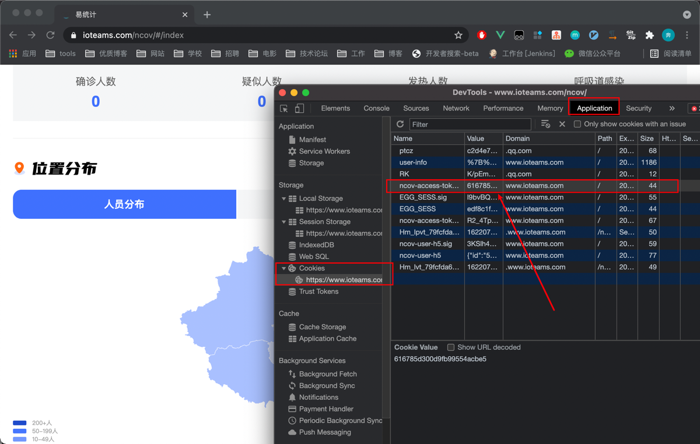
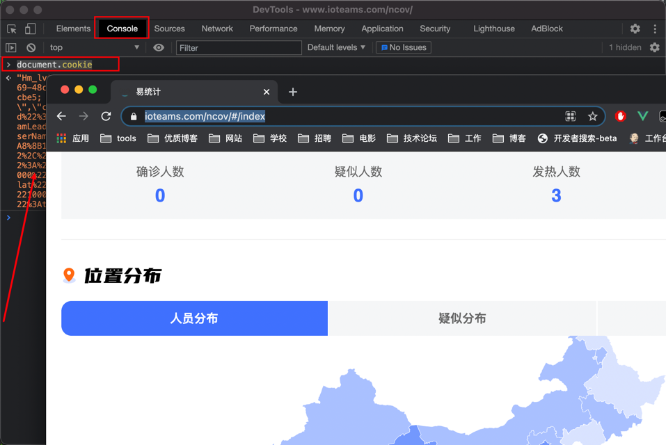
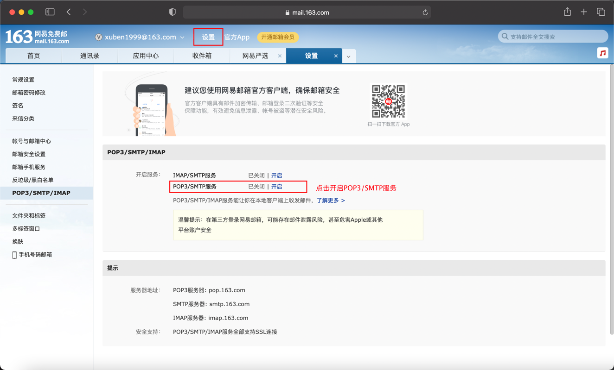
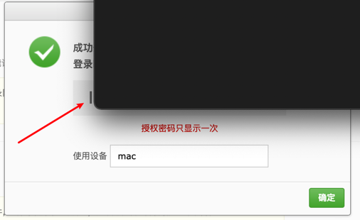
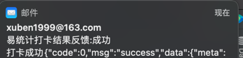
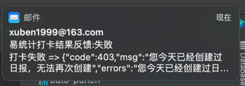

# auto-punch 易统计自动打卡
- 本地运行版本：

1. 拉取项目 `git clone https://gitee.com/xuben99/auto-punch.git`
2. 推荐使用`IDEA`打开
3. 修改配置文件 `application.yml`
4. 需修改项: `cookie`、`token`
---
- 如何获取 易统计的 cookie 和 token ？
1. PC端使用浏览器(推荐Chrome)访问易统计官网：`https://www.ioteams.com/ncov/#/login`
2. 登陆后 按`F12` 
3. 进入`Application`栏目 找到我们的`ncov-access-token-h5`对应的`value`, 填入到配置文件的`token`

4. 进入`Console`栏目 输入`document.cookie` 按回车键执行,结果复制到配置文件的`cookie`

> 注意 cookie 的填写 不要换行，一行即可
5. 运行 `AutoPunchApplication` 即可
6. 默认`不开启`邮件反馈，如有需要，请按教程开启
---
- 如何`开启`打卡结果`邮件反馈`?
> 这里作者用 163邮箱示例，其他邮箱配置原理也是相同的
1. 修改配置文件 `notifyEnable` 为 `true`
2. 登陆 163官网 `https://mail.163.com`
3. 按步骤认证 开启`POP3/SMTP服务`

4.开启成功，记得`备份`授权密码,将此授权码 填入到`password`

5.修改配置文件`username`,填写申请授权密码的邮箱账号，是通知邮件的`发件人`
6.修改配置文件`notifyEmail`,填写 通知邮件的`收件人`
   
---
- 效果示例

--- 
- 常见问题
1. 配置文件`:` 后需跟一个空格，请检查！
2. "code":403,"msg":"您今天已经创建过日报，无法再次创建" `表示已打卡`
3. 发送的邮件被当成`垃圾邮件`处理了,请自行去代码 修改邮件标题
4. 打卡结果 既不是 (成功) 也不是 (已经创建过) ，大概率表示`cookie`已经失效，请使用PC端登陆，重新获取`cookie`即可
5. 若`4`不能解决，使用手机端，重新登录一下`易统计`小程序 即可
6. 邮箱授权密码忘记或想更换，关闭stmp服务后重新开启即可

---
- 创作不易 打赏作者 ☕️

--- 
- 联系作者

✉️ zghbxll@gmail.com 

--- 
- bug反馈与咨询

🐛 bug 或 疑问咨询 可提交`Issues`，或`邮件`联系

